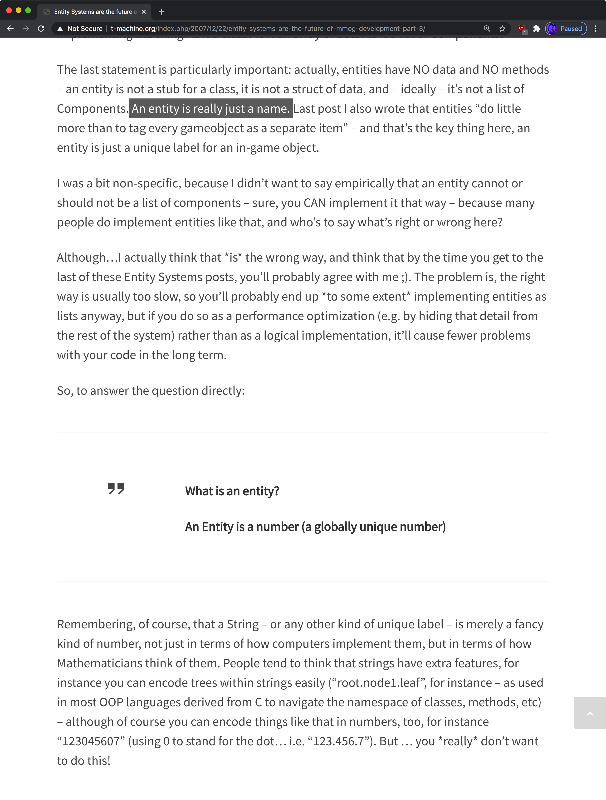

# notes on setting up netlify

https://www.netlifycms.org/docs/gatsby/

npm install --save netlify-cms-app gatsby-plugin-netlify-cms

## troubleshooting: remove localstorate `nelifySiteUrl` key

```localStorage.removeItem("netlifySiteURL");```

* https://github.com/netlify-templates/gatsby-starter-netlify-cms/issues/58

### resolution

* delete all complex app state entries from local storage
* delete identity instance on netlify
* add 'repo' key to config.yaml w/ github repo
* delete all gatsby prod file
* go to https://hardcore-jennings-13cefd.netlify.app/

  * sign up for email first

---

